# Performance Evaluation of Supercapacitor-Integrated DRAM Cells  
### *Compared to Conventional DRAM for Enhanced Efficiency and Reliability*  

**Authors:**  
Souptik Roy, Dr. Abir Chattopadhyay, Dr. Subhajit Das  
*Department of Electronics & Communication Engineering,  
University of Engineering and Management, Kolkata*  

---

## 📘 Overview  
This repository explores a **1T1C DRAM cell** enhanced with **supercapacitor integration** to improve **retention time**, **power efficiency**, and **data stability**.  
Simulations were performed using **Cadence Virtuoso (UMC 180nm)** and **eSim (KiCad + NgSpice)**.  

---

## 🧩 Motivation  
Modern DRAM faces challenges with charge leakage and refresh requirements. The project addresses:  
- Leakage in standard capacitors.  
- Retention vs speed trade-off.  
- Supercapacitor feasibility within DRAM.  

---

## ⚙️ Project Architecture  
### 🧱 1T1C DRAM Cell Structure  
| Component | Description |
|------------|--------------|
| **Transistor (M0)** | NMOS access device |
| **Capacitor (C0)** | Charge storage element |
| **Word Line (WL)** | Controls NMOS gate |
| **Bit Line (BL)** | Data transfer line |
| **Vbit/Vword Inputs** | Write and control pulses |

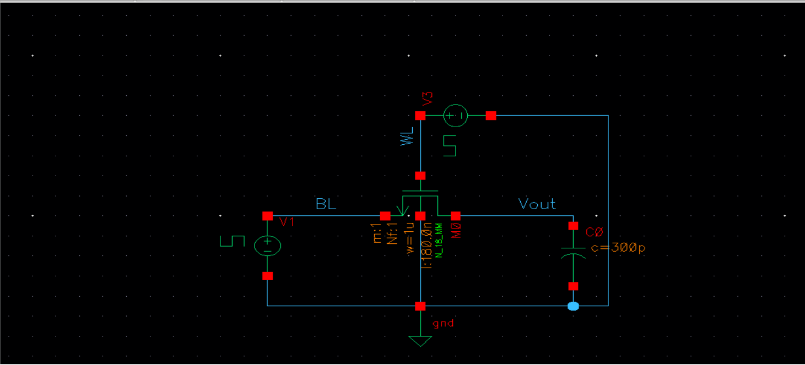
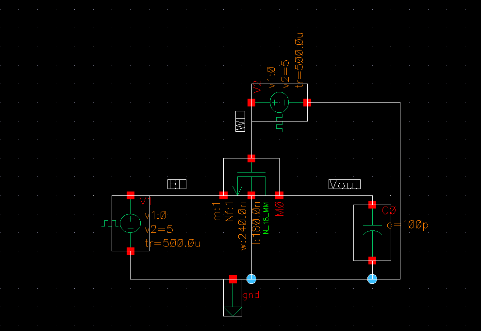


### 🧠 Supercapacitor Integration  
Replaces C0 with a high-density **supercapacitor** to enhance retention.  
\[\tau_{new} = 0.69 \times (R_{NMOS} + R_{SC}) \times (C_{DRAM} + C_{SC})\]

**Effects:**  
- Increases charge retention.  
- Adds ESR, slightly reducing speed.  
- Balances energy efficiency and delay.  

---

## 🧪 Methodology  
- **Tool:** eSim 3.0 (KiCad + NgSpice)  
- **Technology:** 180nm CMOS  
- **Type:** Transient Simulation  
- **Range:** 0–1µs  
- **Temperature:** 27°C  

| Parameter | Range | Note |
|------------|--------|------|
| NMOS Width | 240nm–1µm | Scaling study |
| Capacitance | 10pF–500pF | Standard DRAM |
| Supercap | 1nF–100nF | Integrated DRAM |
| VDD | 5V | Operating voltage |
| RSC | 1kΩ–10kΩ | ESR of supercap |


## 🧰 Simulation Setup  
### eSim/KiCad Steps  
1. Load `DRAm_Final_Sch.PNG`.  
2. Assign signals:
   - `VPULSE` → WL  
   - `VPULSE` → BL  
   - `VBIT` → Write pulse.  
3. SPICE settings:  
   ```text
   TRAN 0.01u 1m
   .OPTIONS RELTOL=0.001 ABSTOL=1e-6
   .SAVE V(BL) V(WL) V(Q)

## Results Summary

| Observation      | Standard DRAM | Supercapacitor DRAM |
| ---------------- | ------------- | ------------------- |
| Retention Time   | 350–410 ms    | >10⁴ s              |
| Rise/Fall Time   | 2.8–4.2 ns    | 6–8 ns              |
| Leakage          | High          | Reduced             |
| Power Efficiency | Moderate      | High                |
| Refresh Rate     | Frequent      | Low                 |

**Optimum:** 500nm NMOS + 1nF Supercap.

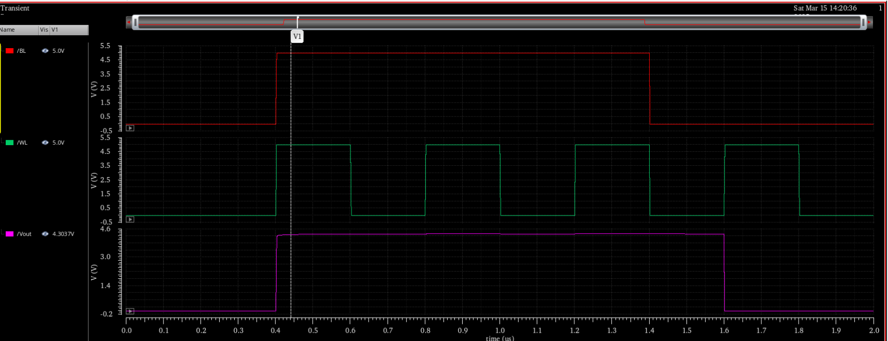
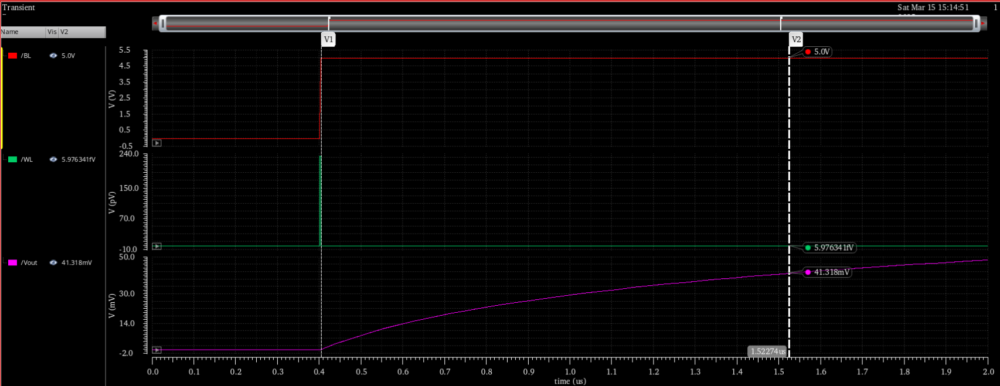
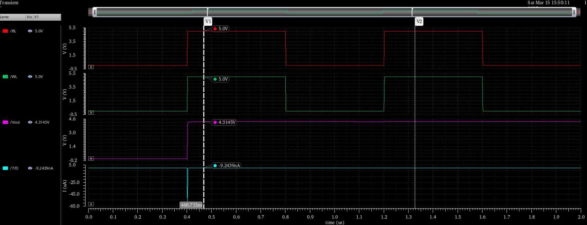
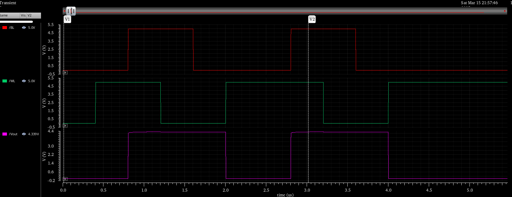
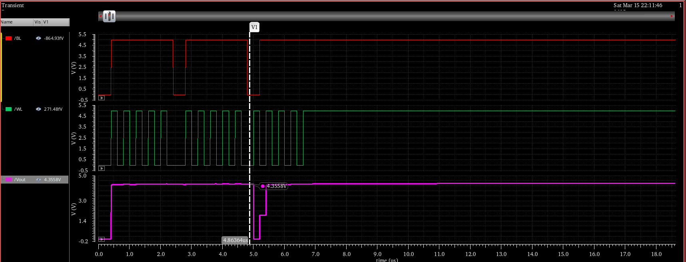
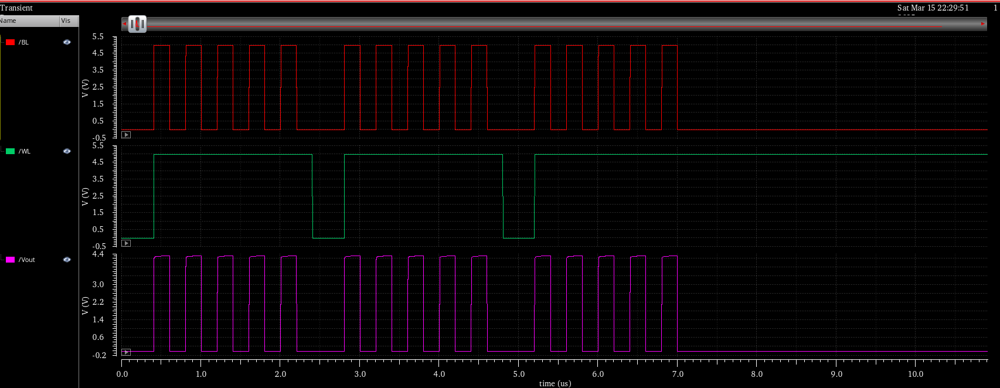
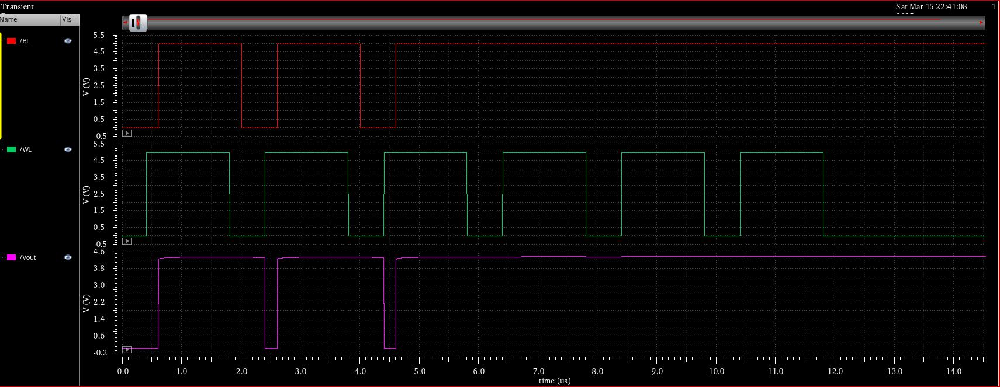
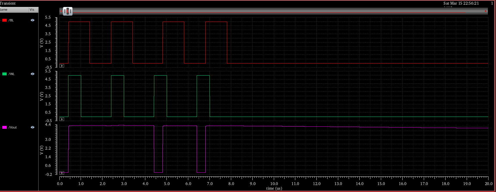

##  Analysis Equations

[T_{ret} = \frac{0.5 \times C \times V_{DD}}{I_{leak}}]
[T_{ret,new} = \frac{0.5 \times (C_{DRAM} + C_{SC}) \times V_{DD}}{I_{leak,eff}}]

**Where:** (I_{leak,eff} = I_{junction} + I_{SC})

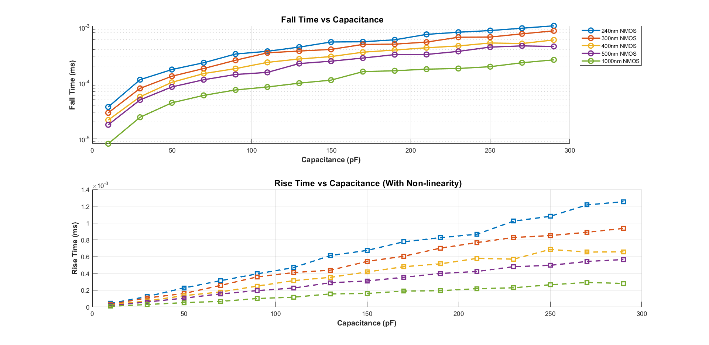
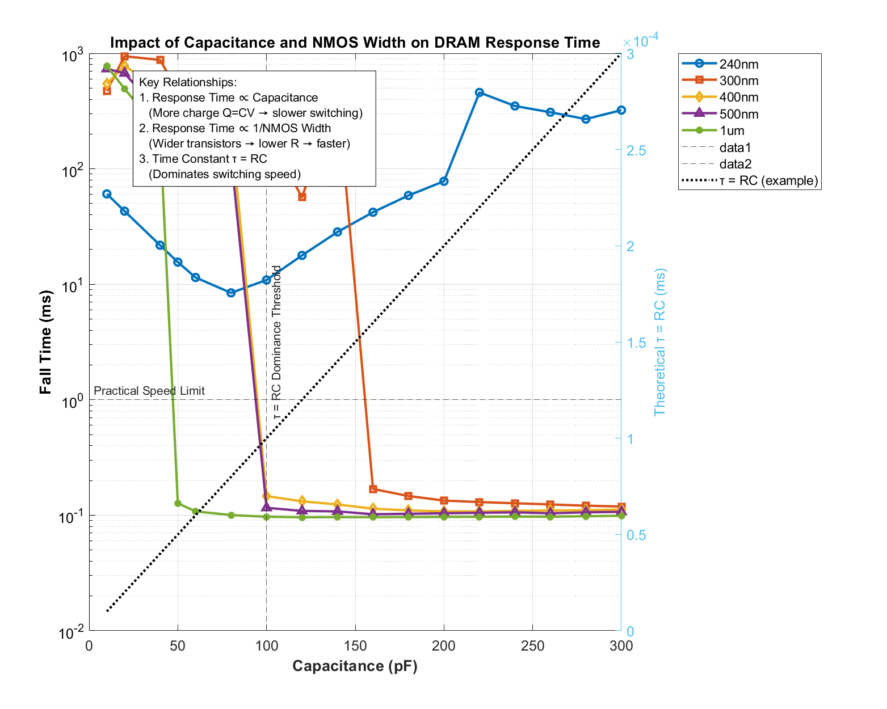
![Analysis]{DRAM_Response_Research_Quality.png)
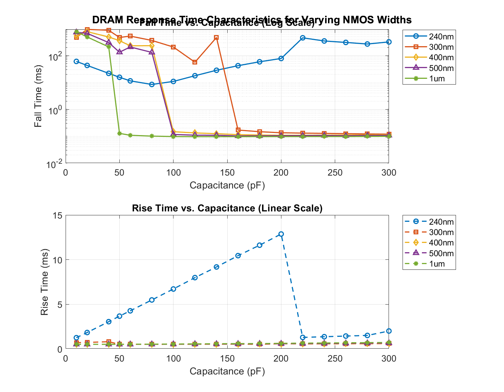
---

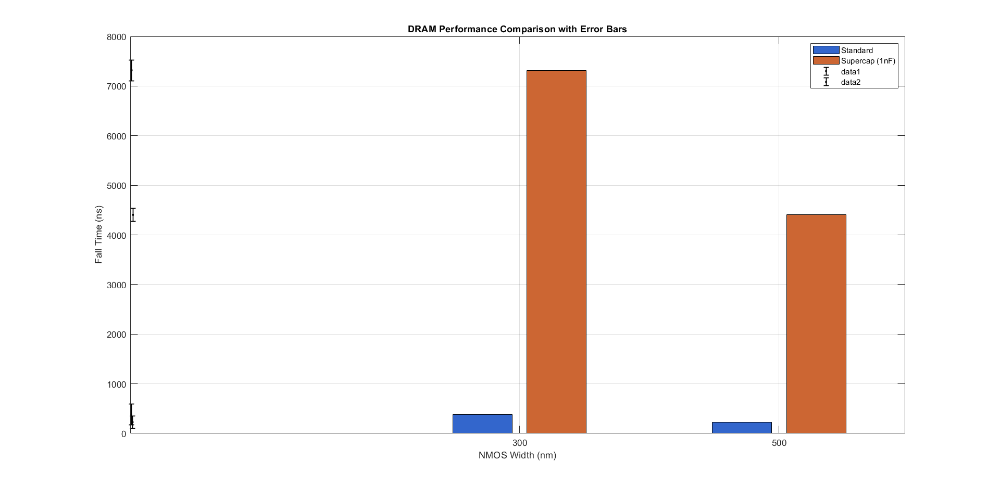
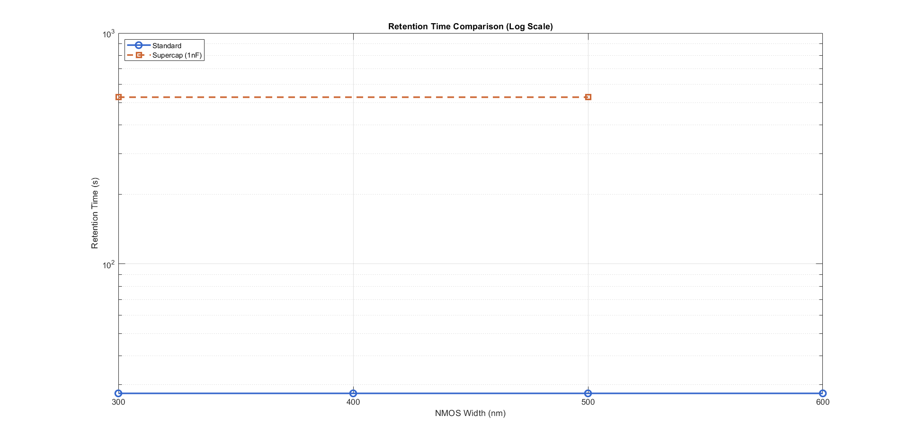
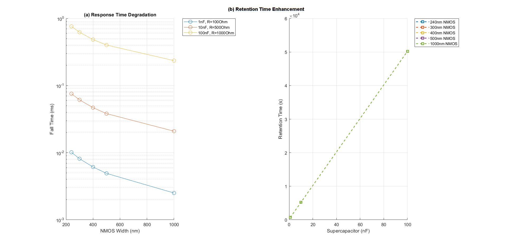
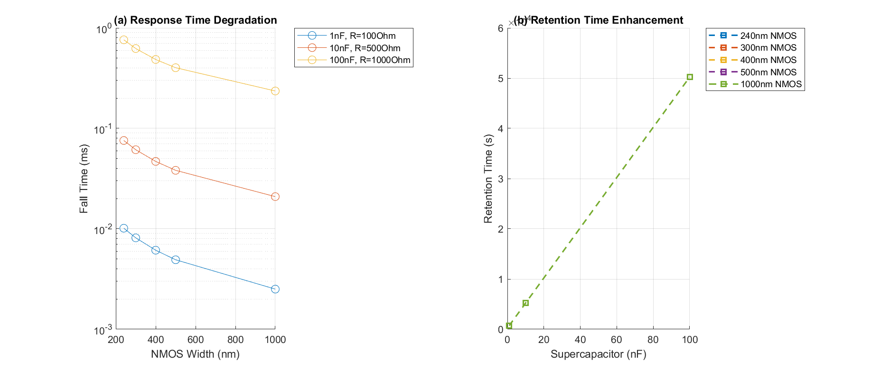

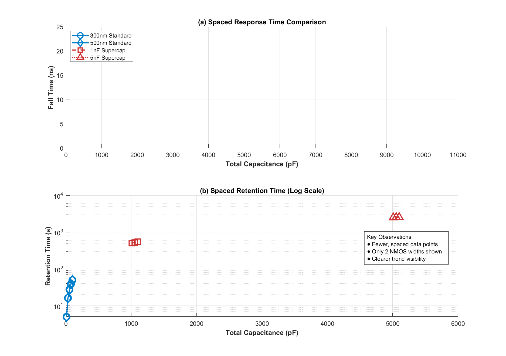

---

## Future Work

* Hybrid capacitor configuration.
* Scaling to <65nm nodes.
* Sense amplifier and refresh circuit design.
* TCAD validation and hardware prototype.

---

## 📂 Repository Structure

```
├── DRAm_Final_Sch.PNG              # DRAM schematic
├── Performance_Analysis.pdf        # Paper & results
├── simulation_files/               # Project circuits
├── plots/                          # Graphs & waveforms
├── data/                           # CSV data files
└── README.md                       # Documentation
```

---

## 📚 References

1. Sankpal & Pete, ICECA 2020
2. Tripathi et al., ICACDOT 2017
3. Ghosh, Miah & Bera, J. Alloys & Compounds 2021
4. Kang & Leblebici, CMOS Digital ICs, McGraw-Hill 2003
5. Dissanayake et al., J. Energy Storage, Elsevier 2024

---

## 🧑‍💻 Citation

> **Souptik Roy**, Dr.Prof.Abir Chattopadhyay, Dr.Prof. Subhajit Das.
> *Performance Evaluation of Supercapacitor-Integrated DRAM Cells Compared to Conventional DRAM for Enhanced Efficiency and Reliability.*
> IEM, University of Engineering and Management, Kolkata.

---

## 🧾 License

**MIT License** – Free to use, modify, and distribute with attribution.

---

## 💬 Contact

📧 [souptikinfo77.@gmail.com]
🔗 [LinkedIn](https://www.linkedin.com)
🏫 University: UEM Kolkata

```
```
